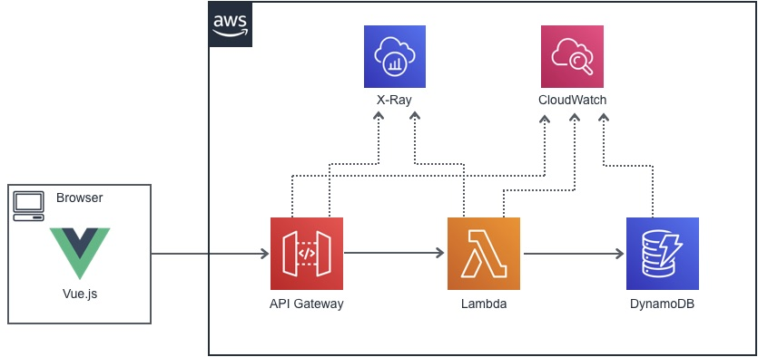
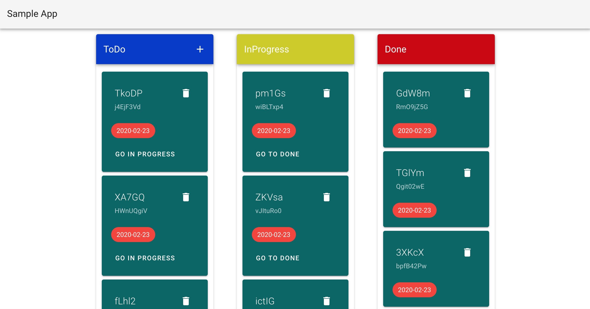

# 第 6 章  AWS 上のサーバーレスアプリケーションの監視

## サンプルアプリケーション（TODOアプリ）

サンプルアプリケーションは、フロントエンドにSPAがあり、バックエンドとしてAPI Gateway、 Lambda、DynamoDB を使用する簡単なサーバーレス構成の ToDo アプリケーションです。



## このディレクトリについて

* backend-api
  * cdk(python)によるAPI Gateway/Lambda/DynamoDBのコードです
* front-app
  * Vue.js(Nuxt.js)のアプリケーションです。

## 画面サンプル



## アプリケーションの動かし方

### Backend APIの構築

#### 環境準備

AWS CDKのインストール

``` bash
$ npm install -g aws-cdk
```

一度もAWS CDKを実行したことがない場合、Bootstrapが必要になります。

``` bash
$ cdk bootstrap
```

Pipenvを利用していますので、pipenvをインストールしてください

``` bash
$ pip install pipenv
```

依存関係のインストール

``` bash
% pipenv install
```

#### Lambda Packageの準備

Lambda functionは `api/lambda` ディレクトに配置しています。  
CDK内で `api/lambda` からパッケージを作成しますが、依存しているパッケージを事前に配置しておく必要があります。

``` bash
$ cd api/lambda
$ pip install -r requirements.txt -t functions/vendor
```

#### CDKの実行

backend-apiディレクトで以下を実行

``` bash
$ cdk deploy
```

最後に作成したAPI GatewayのEndpointが出力されますので、フロントエンドアプリに設定します

```
Outputs:
api.todoapiEndpointXXXXX = https://xxxxxx.execute-api.<region>.amazonaws.com/v1/
```

### Frontend Appの起動

#### API Endpointの設定

API Endpointは環境変数、またはnuxt.config.jsから指定します。

```
$ export API_ENDPOINT="https://xxxxxx.execute-api.<region>.amazonaws.com/v1/"
```

nuxt.config.jsから指定

```
  env: {
    apiEndPoint: process.env.API_ENDPOINT || "https://xxxxxx.execute-api.<region>.amazonaws.com/v1/"
  },
```

#### アプリケーションの起動

``` bash
$ npm install
$ npm run dev
```

http://localhost:3000 からアクセスしてください。


### Frontend Appのデプロイについて

buildコマンドで`/dist`以下に成果物が出力されます。

```
$ npm run build
```

`/dist`以下の全てのファイルを使用するWebサーバーにアップロードしてください。  
APIの`Access-Control-Allow-Origin`はワイルドカード（*）になっています。
